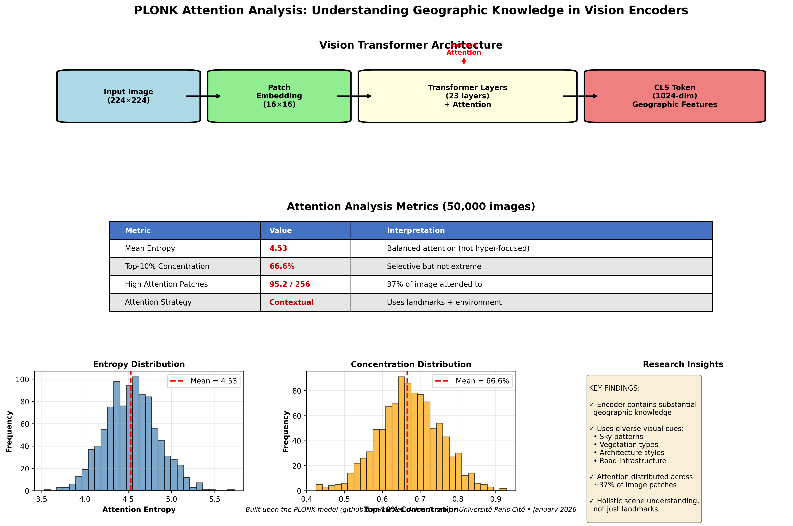

# PLONK Interpretability: Understanding Geographic Knowledge in Vision Encoders

**Interpreting PLONK: Geographic Knowledge in Vision Encoders**

> Built upon the excellent [PLONK](https://github.com/nicolas-dufour/plonk) model by Nicolas Dufour et al.

This repository contains the code and analysis for understanding how PLONK's vision encoder (StreetCLIP) captures and represents geographic knowledge for image-based geolocation tasks.

## 📋 Overview

[PLONK](https://github.com/nicolas-dufour/plonk) is a generative geolocation model that combines a pre-trained vision transformer (StreetCLIP) with flow matching on the Earth's sphere to predict GPS coordinates from street-level images. This research investigates:

1. **How much geographic knowledge is already encoded in the frozen StreetCLIP encoder?**
2. **What visual features does the model attend to for geolocation?**

## 🎯 Research Questions

- Does StreetCLIP already know geography before flow matching training?
- What parts of images does the model focus on for geolocation?
- Does the model rely on obvious landmarks or contextual environmental cues?

## 🔬 Methodology

### 1. Linear Probing Experiments

We evaluate how much geographic knowledge exists in the frozen encoder by training simple linear classifiers (logistic regression) on extracted features.

**Dataset**: OSV-5M Test Set
- 50,000 images sampled from test set
- Geographic labels: Country, Region, City
- 217 countries, ~2,050 regions, 7,292 cities

**Method**:
1. Extract 1024-dim features from frozen StreetCLIP encoder
2. Filter classes: Keep only labels with ≥ 2 samples
3. Train/test split: 80/20 (40k train, 10k test)
4. Train: Logistic Regression with default parameters
5. Evaluate: Accuracy on held-out test set

### 2. Attention Analysis

We analyze attention patterns from the Vision Transformer to understand what visual features the model uses for geolocation.

**Approach**:
1. Extract attention weights from last transformer layer (50,000 images)
2. Focus on CLS token attention to image patches (16×16 grid)
3. Visualize where model "looks" on images
4. Compute statistics: entropy, concentration, spatial patterns

**Key Configuration**:
- Set `vision_model.config._attn_implementation = 'eager'` to enable attention extraction
- Use `output_attentions=True` in forward pass
- Analyze last layer's attention weights averaged across all attention heads

See [Attention Analysis README](attention_analysis/README.md) for detailed documentation.

## 📊 Key Results

### Linear Probing Results

| Level    | Linear Probe | PLONK (10000) | PLONK Paper | Classes |
|----------|--------------|---------------|-------------|---------|
| Country  | **85.0%**    | 78%           | 76.2%       | 217     |
| Region   | **62%**      | 39%           | 44.2%       | 2,050   |
| City     | **8.2%**     | 6%            | 5.4%        | 7,292   |

**Key Findings**:
- The frozen encoder captures substantial geographic knowledge from pre-training
- Linear probe achieves strong accuracy, especially at country and region levels
- Different tasks (classification vs. coordinate regression) explain performance differences
- The encoder already "knows" geography before flow matching training

### Attention Analysis Results

| Metric                      | Value      |
|-----------------------------|------------|
| Images Analyzed             | 50,000     |
| Mean Entropy                | 4.53       |
| Top-10% Concentration       | 66.6%      |
| High Attention Patches      | 95.2 (avg) |

**Key Findings**:
- **Moderate entropy**: Model doesn't hyper-focus on single features (entropy = 4.53)
- **Selective attention**: 67% of attention weight concentrated on top 10% of patches
- **Contextual coverage**: Uses ~95 patches on average (37% of 16×16 = 256 patches)
- **Diverse visual cues**: Model combines landmarks AND environmental cues (sky, vegetation, architectural patterns)
- **Consistent patterns**: Attention strategies remain relatively stable across different countries

## 🔍 Main Insights

1. **Strong Pre-trained Encoder Foundation**: The StreetCLIP encoder already contains substantial geographic knowledge before flow matching training. This validates PLONK's architectural decision to use a frozen pre-trained encoder.

2. **Holistic Scene Understanding**: The model doesn't just focus on obvious landmarks but uses diverse environmental cues including:
   - Sky patterns and atmospheric conditions
   - Vegetation types and natural environment
   - Architectural styles and building patterns
   - Road infrastructure and urban planning
   - Environmental context (rural vs. urban, climate indicators)

3. **Distributed Attention**: Attention is distributed across ~37% of image patches, indicating holistic scene understanding rather than simple landmark detection. The model integrates information from multiple regions simultaneously.

4. **Two-Stage Architecture Validation**: Results validate PLONK's design choice of using a frozen pre-trained encoder with flow matching:
   - Encoder provides strong geographic features
   - Flow matching refines these into precise coordinate predictions
   - This separation of concerns allows for interpretability

## 🏗️ Repository Structure

```
plonk-interpretability/
├── linear_prob_1.ipynb           # Linear probing experiments
├── Attention_2.ipynb             # Attention analysis & visualization
├── attention_analysis/           # Attention results & visualizations
│   ├── README.md                 # Detailed attention analysis docs
│   ├── attention_statistics_50k.csv
│   └── visualizations/
├── requirements.txt              # Python dependencies
└── README.md                     # This file
```

## 🚀 Getting Started

### Prerequisites

```bash
# Clone this repository
git clone https://github.com/imedpsd/plonk-interpretability.git
cd plonk-interpretability

# Install dependencies
pip install -r requirements.txt
```

### Download Dataset

```python
from huggingface_hub import hf_hub_download, hf_hub_url
import pandas as pd

# Download test.csv
csv_path = hf_hub_download(
    repo_id="osv5m/osv5m",
    repo_type="dataset",
    filename="test.csv"
)

# Download images (example: first batch)
# Note: Full dataset is large (~100GB for test set)
# Download only what you need for experimentation
url = hf_hub_url(
    repo_id="osv5m/osv5m",
    filename="images/test/00.zip",
    repo_type="dataset"
)
```

### Running Linear Probing

Open and run `linear_prob_1.ipynb`:

```python
from plonk import PlonkPipeline

# Load PLONK pipeline
pipeline = PlonkPipeline("nicolas-dufour/PLONK_OSV_5M")

# Extract features from images
# See notebook for full implementation
```

### Running Attention Analysis

Open and run `Attention_2.ipynb`:

```python
from plonk import PlonkPipeline

# Load model with attention extraction enabled
pipeline = PlonkPipeline("nicolas-dufour/PLONK_OSV_5M")
vision_model = pipeline.cond_preprocessing.emb_model.vision_model

# CRITICAL: Enable attention extraction
vision_model.config._attn_implementation = 'eager'
vision_model.config.output_attentions = True

# Extract attention weights
# See notebook and attention_analysis/README.md for details
```

## 📊 Visualizations

The repository includes attention visualizations showing:
- Attention heatmaps overlaid on original images
- Statistical distributions of attention patterns
- Comparative analysis across different countries
- Examples of focused vs. diffuse attention patterns

See `attention_analysis/` folder for generated visualizations from 50,000 images.

## 📈 Future Directions

Potential extensions of this research:

1. **Fine-tuned Encoder Comparison**: Replace frozen encoder with fine-tuned version and retrain flow matching to measure performance impact. Would fine-tuning improve or harm the geographic knowledge?

2. **Layer-wise Analysis**: Analyze attention patterns at different encoder layers to understand hierarchical geographic feature learning. How does geographic understanding emerge across layers?

3. **Failure Case Analysis**: Study encoder behavior on failure cases to identify limitations and potential improvements. What types of scenes confuse the model?

4. **Geographic Bias Study**: Analyze if attention patterns vary across different geographic regions and cultural contexts. Does the model show bias toward certain regions?

5. **Feature Attribution**: Use gradient-based methods (e.g., Integrated Gradients) to complement attention analysis and identify which visual features are most important.

6. **Cross-Model Comparison**: Compare attention patterns with other geolocation models to understand what makes PLONK's approach effective.

## 📚 Citation

If you use this code or findings in your research, please cite:

Please cite the original PLONK paper:

```bibtex
@article{dufour2024plonk,
  title={PLONK: Probabilistic Localization on the Sphere},
  author={Dufour, Nicolas and others},
  journal={arXiv preprint},
  year={2024}
}
```

## 📝 Related Work

- **[PLONK](https://github.com/nicolas-dufour/plonk)**: Original PLONK implementation and paper
- **StreetCLIP**: Vision-language model trained on street-level imagery
- **[OSV-5M Dataset](https://huggingface.co/datasets/osv5m/osv5m)**: Large-scale street-view dataset with 5M images

## 🙏 Acknowledgments

This work is built upon the excellent [PLONK model](https://github.com/nicolas-dufour/plonk) by Nicolas Dufour and colleagues. We thank them for:
- Creating and open-sourcing PLONK
- Providing the pre-trained StreetCLIP encoder
- Making their codebase accessible and well-documented


## 👤 Author

**Imed-Eddine BOUKHARI**  
Université Paris Cité  
January 2026


**Note**: This is an interpretability study of the PLONK model. For the original PLONK implementation and training code, please visit the [official PLONK repository](https://github.com/nicolas-dufour/plonk).
